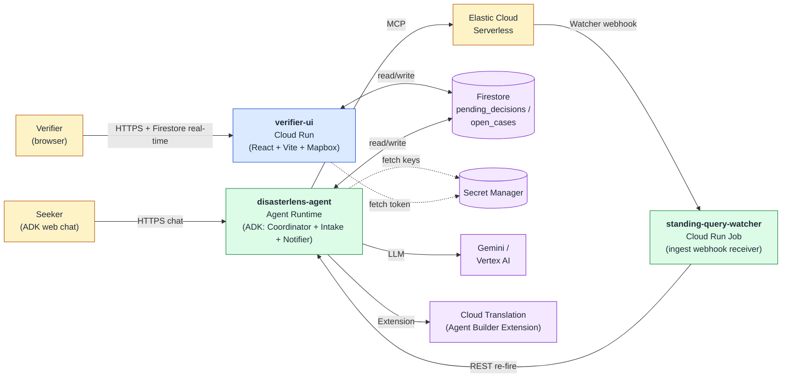
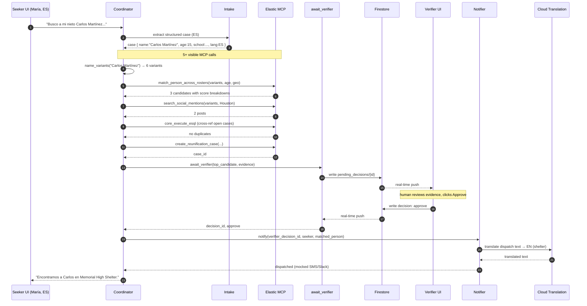

# DisasterLens — System Design

> **Scope:** what we build for the 2026-06-11 hackathon submission. Solo, ~26 days. Companion to [PRD.md](PRD.md) — the PRD owns *what* and *why*; this document owns *how it runs*.

## 1. Non-Goals

To keep the build honest, these are **out of scope** for this submission:

- Multi-container microservice fabric (no A2A bus, no service mesh, no sidecars)
- Custom gateway / control-plane abstractions over Vertex AI
- Externalised business-rule services or semantic-plane layers
- Dual-audit-trail infrastructure (single Cloud Logging stream is fine)
- OAuth issuer or per-agent identities
- Anything not visible in the 3-minute demo or required by the judging rubric

If a "good architecture" instinct conflicts with the above, the instinct loses. The submission is judged on a 3-minute video, an eval scoreboard, and a live URL — not on production-readiness.

---

## 2. Hackathon Phase Alignment

Direct mapping to the hackathon's recommended platform path. Every row is a name-drop in the README architecture section and a visible call in the demo trace.

| Hackathon Phase | Service | Used for |
|---|---|---|
| **Phase 1 — Frameworks** | **Google ADK** (Agent Development Kit, Python) | The whole agent app — root coordinator + two sub-agents + tools |
| **Phase 1 — LLM** | **Gemini 2.x on Vertex AI** | Reasoning, multilingual extraction, evidence drafting, notification drafting |
| **Phase 2 — Tools** | **Agent Builder Extensions** | Cloud Translation (one visible call in trace) |
| **Phase 2 — Tools** | **ADK `MCPToolset`** → **Elastic Agent Builder MCP** | All compound searches and case writes via 4 custom Elastic skills |
| **Phase 2 — Grounding** | *Not used.* Elastic is the data layer; Agent Builder Data Stores do not fit this use case | — |
| **Phase 3 — Partner** | **Elastic Cloud Serverless 9.x** | 4 indices with compound name analyzers (PRD §4.3) + E5-multilingual inference |
| **Phase 4 — Hosting** | **Agent Runtime** | Managed Python host for the ADK app |
| **Phase 4 — State** | **Firestore (Native mode)** | Pending verifier queue, decisions, open case records |
| **Phase 4 — Secrets** | **Secret Manager** | Elastic API key, Mapbox token, webhook HMAC key |
| **Phase 5 — Deployment** | **Cloud Run** (service) | Verifier UI |
| **Phase 5 — Deployment** | **Cloud Run** (job) | Standing-query watcher (Elastic ingest webhook receiver) |
| **Phase 5 — Safety** | **Gemini Safety Settings** | Explicit thresholds in agent config; load-bearing in a missing-persons domain (see §7) |
| **Phase 5 — Observability** | **Cloud Logging** + **Cloud Trace** (auto-instrumented by Agent Runtime / Cloud Run) | One structured-log stream, trace correlation via session id |

---

## 3. Runtime Topology

Three deployables. That's the entire fleet.



---

## 4. Agent Composition

**One ADK app, three agents, four tool clusters.** Sub-agents are kept because they tell a clear multi-agent story in the demo trace; they are not load-bearing infrastructure.

```
Coordinator (LlmAgent — root)
├── sub_agents:
│   ├── Intake      — multilingual structured-case extraction
│   └── Notifier    — drafts + dispatches notifications in target language
└── tools:
    ├── elastic_mcp        — MCPToolset → Elastic Agent Builder MCP
    │                        (match_person_across_rosters, search_social_mentions,
    │                         create_reunification_case, register_standing_query,
    │                         core_execute_esql, core_index_explorer)
    ├── name_variants      — FunctionTool: ICU translit + double-metaphone +
    │                        nickname-graph expansion (rule-based, no LLM)
    ├── cloud_translation  — Agent Builder Extension
    └── await_verifier     — LONG-RUNNING FunctionTool (HITL gate — see §6)
```

**Why this shape:**
- The Coordinator owns the reasoning loop and the visible MCP calls — that's the "5–8 tool calls per chain" the PRD requires.
- Intake is split out so the demo trace shows a clean handoff from "understanding what María said" to "searching for Carlos."
- Notifier is split out so the multilingual dispatch is visibly a distinct step (Spanish for María, English for the shelter coordinator).
- Name variants live as a tool, not a sub-agent — it's deterministic rule-based work; spinning it into a sub-agent buys nothing.

**System prompt rules (Coordinator) — load-bearing for safety:**

1. Detect the seeker's language; respond in that language.
2. **Never assert a person is at a location.** Frame every claim as "candidate match with evidence X, pending verifier approval."
3. Always call `elastic_mcp` before answering — never guess about who is or isn't at a shelter.
4. For non-Roman-script names, call `name_variants` *before* searching; pass the full variant set into `elastic_mcp`.
5. Before calling `cloud_translation` or any dispatch tool, you **must** have a verifier decision id from `await_verifier`. Refuse otherwise.
6. If best-candidate confidence < 0.75, ask the seeker for one distinguishing detail before invoking `await_verifier`.

Full prompt lives in `agent/prompts.py`.

---

## 5. Data Flow — Golden Demo Path



**Tool-call budget for the trace:** 1 Intake handoff + 1 name_variants + 4 Elastic MCP + 1 await_verifier + 1 Notifier handoff + 1 Cloud Translation Extension = **9 visible boxes** in the demo trace, of which **4 are Elastic MCP**. Hits the PRD's 5–8 MCP-calls success criterion when you add the second beat (coordinator triage ES|QL) and the third beat (مُحَمَّد re-search).

---

## 6. Human-in-the-Loop — ADK Long-Running Tool + Firestore

This is the canonical ADK pattern. No polling loop, no WebSocket bridge, no separate verifier agent.

**Mechanism:**
1. Coordinator calls `await_verifier(candidate, evidence)`.
2. The tool writes a document to `pending_decisions/{decision_id}` in Firestore and **returns control to ADK with `long_running=True`**. The agent run pauses.
3. The Verifier UI uses Firestore's **real-time listener** (`onSnapshot`) on the `pending_decisions` collection — new docs appear instantly in the queue, no polling.
4. Verifier clicks Approve / Reject / Request more in the UI. UI writes `decision`, `verifier_id`, `decision_at` to the same Firestore doc.
5. The `await_verifier` tool has a Firestore listener on its own decision doc; when the field appears, the tool returns the decision payload to ADK. The agent run resumes.
6. The decision id flows into the Coordinator's context. The Notifier refuses to dispatch without it (system prompt rule #5).

**Why Firestore beats Redis here for solo build:**
- No provisioning, no VPC, no Memorystore instance to keep running
- Real-time listeners are a single line of code on both sides — no Pub/Sub channel, no WebSocket bridge
- Native browser SDK with auth — the React UI talks directly, no Cloud Run middle layer
- Survives Agent Runtime restarts; the decision id is durable

**Demo-video impact:** when the verifier clicks Approve, the agent's "thinking" indicator visibly resumes within ~500ms — that's the focal point of the HITL beat (PRD §11, 1:00–1:50).

---

## 7. Safety Configuration

Load-bearing in this domain. The agent identifies minors and missing persons; a hallucinated "we found your grandson at Shelter X" is an operational harm.

**Three layers stacked:**

1. **Gemini safety thresholds** in `agent/config.py`:
   ```python
   SAFETY_SETTINGS = {
       HarmCategory.HARM_CATEGORY_DANGEROUS_CONTENT: HarmBlockThreshold.BLOCK_LOW_AND_ABOVE,
       HarmCategory.HARM_CATEGORY_SEXUALLY_EXPLICIT: HarmBlockThreshold.BLOCK_LOW_AND_ABOVE,
       HarmCategory.HARM_CATEGORY_HARASSMENT:        HarmBlockThreshold.BLOCK_MEDIUM_AND_ABOVE,
       HarmCategory.HARM_CATEGORY_HATE_SPEECH:       HarmBlockThreshold.BLOCK_MEDIUM_AND_ABOVE,
   }
   ```
2. **System-prompt invariants** (§4 rules #2 and #5) — never assert location; never dispatch without verifier id.
3. **The verifier gate itself** — no externally-visible action without a human Approve recorded in Firestore.

Mention all three on screen during the video's "why it matters" close (2:40).

---

## 8. Standing-Query Re-Fire

When new shelter roster entries land in Elastic, open cases with `standing_query_active: true` should re-fire their search.

**Mechanism (simplest version that works):**
- Elastic **Watcher** (or a tiny periodic scan) POSTs new doc ids + HMAC to `standing-query-watcher` Cloud Run Job.
- Watcher queries Firestore for open cases whose subject hints intersect the new doc.
- For each match, watcher POSTs a re-fire request to the agent app's `/refire` REST endpoint.
- The agent re-runs the search flow without the Intake step (case is already structured), going through the same HITL gate if a new candidate is found.

The re-fire is **demo-able as a "third beat"** if time allows: ingest a new roster row mid-demo, show the standing query fire and a new candidate appear in the verifier queue.

---

## 9. State, Secrets, Observability

### State
| What | Where |
|---|---|
| Reunification cases (operational) | Elastic `reunification_cases` index (PRD §4.3) |
| Pending verifier decisions | Firestore `pending_decisions/{decision_id}` |
| Verifier decisions (durable record) | Firestore + denormalised onto the Elastic case doc |
| Agent session state | ADK session (in Agent Runtime) |

### Secrets
All in Secret Manager. The agent and UI fetch at boot. No `.env` files, no inline keys.
- `elastic-api-key`
- `mapbox-public-token` (yes, public-prefixed Mapbox tokens still go through Secret Manager — keeps deploy clean)
- `standing-query-webhook-hmac`
- `firestore-project-id` (not a secret but lives in the same config map for symmetry)

### Observability
- **Cloud Trace** auto-instrumented by Agent Runtime. Each agent run is a trace; each tool call is a span. Free demo content for the video.
- **Cloud Logging** one structured stream. Every log line includes `case_id` and `decision_id` (when present) for cross-cutting search.
- **Saved queries** for the operations dashboard (set up in Sprint 3): "open cases by language", "pending verifier > 5min", "candidates surfaced today".

No CAT/PST split. No OTEL collector. No separate audit vault.

---

## 10. Deployment

```
deploy.sh
├── 1. gcloud secrets versions add (idempotent)
├── 2. uv export --requirements requirements.txt
├── 3. gcloud beta agent-runtime deploy ./agent          # disasterlens-agent
├── 4. (cd verifier_ui && npm run build)
├── 5. gcloud run deploy verifier-ui --source=verifier_ui
└── 6. gcloud run jobs deploy standing-query-watcher --source=standing_query_watcher
```

Cold-start target: <15s for the agent (single-region, min-instances=1 during judging window).

The **agent's chat UI** is served by ADK's built-in dev UI exposed through Agent Runtime — no custom seeker UI to build for the hackathon. Demo records against this UI.

---

## 11. Repository Layout

```
disasterlens/
├── LICENSE                          # MIT (REPO ROOT — submission requirement)
├── README.md
├── pyproject.toml
├── .python-version
│
├── agent/
│   ├── main.py                      # ADK app entry point
│   ├── coordinator.py               # root LlmAgent
│   ├── intake.py                    # Intake sub-agent
│   ├── notifier.py                  # Notifier sub-agent
│   ├── prompts.py                   # system prompts (one per agent)
│   ├── config.py                    # model id, safety settings, thresholds
│   └── tools/
│       ├── elastic.py               # MCPToolset wiring
│       ├── name_variants.py         # ICU + metaphone + nickname graph
│       ├── translation.py           # Agent Builder Extension client
│       └── verifier.py              # await_verifier (LONG-RUNNING)
│
├── verifier_ui/                     # Cloud Run service
│   ├── package.json
│   ├── Dockerfile
│   └── src/
│       ├── App.tsx
│       ├── components/
│       │   ├── ReunificationMap.tsx
│       │   ├── CandidateQueue.tsx
│       │   └── CandidateCard.tsx
│       └── lib/firestore.ts         # onSnapshot listeners
│
├── standing_query_watcher/          # Cloud Run Job
│   ├── main.py
│   └── Dockerfile
│
├── data/
│   ├── generate_synthetic.py        # incl. deterministic variant generator
│   ├── ingest_to_elastic.py
│   ├── mappings/                    # 4 index JSON files
│   └── analysis/nicknames.txt       # synonym_graph
│
├── extensions/
│   └── cloud_translation.yaml       # Agent Builder Extension manifest
│
├── evals/
│   ├── family_pairs.jsonl           # 50-case gold set
│   └── score.py
│
├── scripts/
│   ├── deploy.sh
│   └── seed_demo.sh                 # resets Elastic + Firestore for a clean demo
│
└── docs/
    ├── PRD.md
    ├── design.md                    # THIS FILE
    └── use_case.md                  # historical brief
```

---

## 12. Build Order (Maps to PRD §10 Sprints)

This document only specifies *what to build*; PRD §10 owns the sprint dates.

**Sprint 1 — Foundation**
1. Elastic Cloud Serverless provisioned; 4 indices with analyzers; E5-multilingual inference endpoint working
2. Google Cloud project: Vertex AI + Agent Runtime + Cloud Run + Firestore + Secret Manager + Cloud Translation API enabled
3. Synthetic data with deterministic name-variant gold set
4. ADK "hello-world" agent calling Elastic MCP — one round-trip working end-to-end
5. Agent Builder Extension for Cloud Translation registered

**Sprint 2 — Agent + UI**
1. Coordinator + Intake + Notifier with full system prompts
2. `await_verifier` long-running tool + Firestore wiring
3. React verifier UI: candidate queue, side-by-side comparison card, approve modal
4. Mapbox reunification map (hero visual)
5. End-to-end golden path (Spanish seeker → Carlos match → verifier approve → multilingual dispatch) works locally

**Sprint 3 — Polish + Deploy**
1. 50-case eval scoring (`evals/score.py`)
2. Standing-query watcher
3. Deploy all three services; cold-start <15s
4. Architecture diagram (single image for video)
5. Native Spanish-speaker review
6. Cost-story slide (per-case marginal cost)

**Submission week (PRD §10)** — record video, write README hook, Devpost submission.

---

## 13. What's Explicitly Not in Here

- **Multi-container service fabric.** Three deployables, no more.
- **A2A bus, capability registry, service mesh, OAuth issuer.** Not used.
- **AI Gateway wrapper.** Direct Vertex AI SDK is fine.
- **Externalised business-rule service.** Thresholds are named constants in `agent/config.py`. If they change, edit the file.
- **Dual audit trail (CAT/PST split).** One Cloud Logging stream.
- **Sidecar tool containers.** ADK FunctionTools and the Extension manifest are sufficient.
- **EU AI Act FRIA.** Two paragraphs in the README on safety + verifier gate covers the spirit; no separate doc.

If a future requirement makes one of these necessary, add it here with a one-paragraph justification. Until then, they're out.
